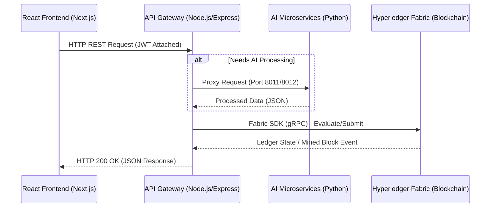

# BhumiChain System Workflow & Architecture Report

This report details the end-to-end technical workflow between the Next.js Frontend, the Node.js API Gateway (Backend), and the Hyperledger Fabric Blockchain.

## 1. High-Level Architecture Flow

## 2. Authentication & Identity Workflow
BhumiChain uses a stateless, privacy-preserving authentication model.

1. **User Action:** The user enters their Aadhaar number and OTP on the frontend.
2. **Backend Processing:** 
   - The backend hashes the Aadhaar number using `SHA-256` (enforcing DPDPA 2023 compliance).
   - It mints a **JWT (JSON Web Token)** containing the user's `role` and `aadhaarHash`.
3. **Subsequent Requests:** The frontend attaches this JWT in the `Authorization: Bearer` header for all future requests. The backend middleware decodes it to securely identify the caller.

## 3. Data Read Workflow (Querying the Ledger)
Used for loading pages like "My Parcels" or "GIS Map".

1. **Frontend Request:** `GET /api/dlpi/my-parcels`
2. **Backend Gateway:** The `dlpi.js` route intercepts the request, verifies the JWT, and extracts the `aadhaarHash`.
3. **Fabric SDK:** The backend uses `contract.evaluateTransaction('QueryDLPIsByOwner', aadhaarHash)`.
4. **Blockchain State DB:** The local Fabric Peer queries its CouchDB state database using a rich JSON selector and returns the results instantly. No consensus is required.
5. **Response:** The backend formats the JSON and sends it back to the React UI for rendering.

## 4. Data Write Workflow (Executing Mutations)
Used for critical actions like Property Transfer, Encumbrance Locking, and Succession Consent.

> [!CAUTION]
> Write operations are strictly controlled. They require cryptographic endorsement and consensus across the blockchain network.

1. **Frontend Request:** User clicks "Accept My Share" (eSign). `POST /api/succession/consent`.
2. **Backend Gateway:** Parses the request, validates the JWT, and constructs the blockchain payload.
3. **Fabric SDK (Endorsement Phase):** 
   - The backend uses `contract.submitTransaction('SignConsent', dlpiId)`.
   - The SDK sends the transaction proposal to the endorsing peers (e.g., `peer0.revenuedept` and `peer1.revenuedept`).
   - The peers simulate the transaction against their local ledger state and return cryptographically signed endorsements.
4. **Fabric SDK (Ordering Phase):** 
   - The SDK collects the endorsements and forwards them to the **Orderer Node**.
   - The Orderer packages the transaction into a new block using the Raft consensus algorithm.
5. **Ledger Commit:** The block is distributed to all peers, the world state is updated (auto-mutation triggered), and an event is emitted back to the backend.
6. **Response:** The Node.js backend returns a `200 OK` with the new Transaction Hash (`txId`) to the frontend.

## 5. Microservice Integration Workflow
The Node.js backend acts as a reverse proxy for specialized AI services to avoid browser CORS restrictions.

* **NyayaAI (Dispute Resolution):** Frontend calls `/api/ai/nyaya/generate-brief`. The Node backend proxies this to `http://localhost:8012` where the Python Flask app runs LangChain and Groq LLMs.
* **Coparcenary Mapper:** Frontend calls `/api/ai/coparcenary/map`. Proxied to `http://localhost:8011` to parse legacy unstructured family trees into JSON graphs.
* **CRS Oracle:** External Death Certificate triggers hit `/api/oracle/webhook`, which directly triggers the `uttaradhikar` smart contract to initiate succession on-chain.

## 6. Infrastructure & Docker Workflow (Hyperledger Fabric)
The entire blockchain network runs natively on your Azure VM using Docker containers, orchestrated by `docker-compose`. This creates a robust, isolated, and scalable environment.

1. **The Network Components (Containers):**
   - **`orderer.bhumichain.in`**: The Orderer node that runs the Raft consensus mechanism to package transactions into blocks.
   - **`peer0` & `peer1` (`revenuedept.bhumichain.in`)**: The Endorsing Peers that maintain the ledger copy and execute the smart contracts (chaincode).
   - **`couchdb0` & `couchdb1`**: The State Databases attached to each peer, allowing for rich JSON queries (like searching for parcels by Aadhaar hash).
   - **`cli`**: The Fabric tools container used to manually interact with the blockchain (e.g., querying `GetDLPIHistory` directly).
   - **`ca.revenuedept`**: The Certificate Authority that issues the cryptographic X.509 identities for the users and nodes.

2. **The Docker Workflow:**
   - The network is spun up using `bash start-network.sh`, which uses `docker-compose` to pull the Hyperledger images and map the cryptographic material (`crypto-config`) into the containers via Docker volumes.
   - Smart contracts (Chaincodes) like `dlpi.go` are installed directly onto the Peer containers.
   - When the Node.js API Gateway connects to the blockchain, it uses the `fabric-network` SDK to route gRPC calls over the internal Docker network (`bhumichain_network`) directly to `peer0` or `peer1` on ports `7051` and `9051`.

> [!TIP]
> **Performance Optimization**
> Because the backend is entirely stateless and relies on the Fabric CouchDB, it can be horizontally scaled using PM2 cluster mode or Kubernetes without any database bottleneck!
